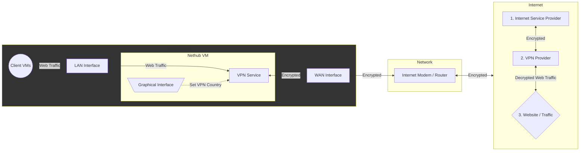
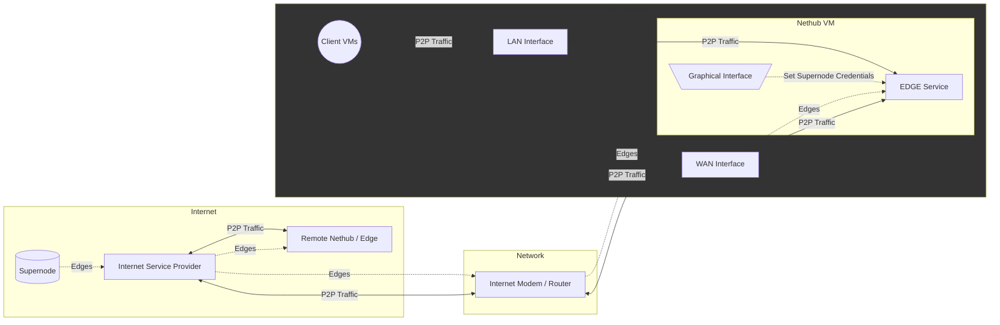

# Nethub Architecture

## Nethub VPN

```mermaid
flowchart LR

subgraph Internet
    ISP[1. Internet Service Provider]
    P[2. VPN Provider]
    T{3. Website / Traffic}
end

subgraph Hypervisor
    VM((Client VMs))
    subgraph Nethub VM
        V[VPN Service]
        G[\Graphical Interface/]  
    end
    W[WAN Interface]
    L[LAN Interface]
end

subgraph Network
    M[Internet Modem / Router]
end

VM <-->|Web Traffic| L <--->|Web Traffic| V <-->|Encrypted| W
<-->|Encrypted| M


M <-->|Encrypted| Internet
G -.->|Set VPN Country| V
ISP <-->|Encrypted| P <-->|Decrypted Web Traffic| T

classDef h1 fill:#333,font-size:20px;
class Hypervisor h1

```

## Nethub EDGE

```mermaid
flowchart LR

subgraph Internet
    RH[Remote Nethub / Edge]
    S[(Supernode)]
    ISP[Internet Service Provider]
end

subgraph Hypervisor
    VM((Client VMs))
    subgraph Nethub VM
        E[EDGE Service]
        G[\Graphical Interface/]  
    end
    W[WAN Interface]
    L[LAN Interface]
end

subgraph Network
    M[Internet Modem / Router]
end

VM <-->|P2P Traffic| L <--->|P2P Traffic| E <-->|P2P Traffic| W <-->|P2P Traffic| M
M <-->|P2P Traffic| ISP <-->|P2P Traffic| RH
G -.->|Set Supernode Credentials| E
ISP -..->|Edges| M -.->|Edges| W -.->|Edges| E
ISP -.->|Edges| RH
S  -.->|Edges| ISP

classDef h1 fill:#333,font-size:20px;
class Hypervisor h1

```
